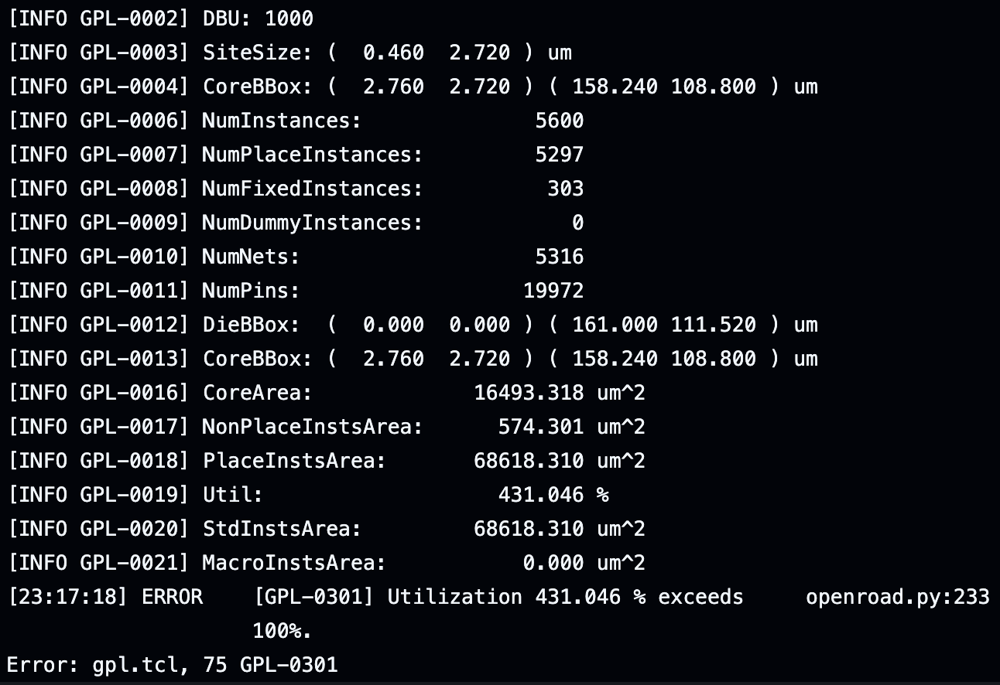

# ASIC Project - Phase II

## Team Name: 
ASIC_SPI_SERV

## Team Members:
- Kavish Ranawella (bue6zr)
- Bhasitha Dharmasena (bp2sq)

## Project Title: (changed with Professor's permission)
TinyTapeout Design for Serial RISC-V (SERV) with SPI memory access

## Project Description:
Serial RISC-V (SERV) is a bit-serial CPU which claims to be the world's smallest RISC-V CPU. In the current implementation, even though most of the core components are serialized, Register File and Memory accessing is still done parallely via a Wishbone interface. With our FPGA project, we aim to achieve pure serialization by implementing memory access through a Serial Peripheral Interface (SPI). With the ASIC project, we aim to implement this design in TinyTapeout.

## Key Objectives:
- Learn intricate details of the OpenLane2 ASIC design flow used in TinyTapout.
- Evaluate the readiness of the SERV with SPI for a tapeout using TinyTapeout.

## Technology Stack:
Tools: Tiny Tapeout, OpenLane2

Languages: Verilog, TCL

## Expected Outcomes:
- Github repository for TinyTapeout10.
- Documentation of our findings during our project.

## Tasks:
- Develop Verilog code for a Wishbone-to-SPI converter.
- Integrate the Wishbone-to-SPI converter with the SERV CPU.
- Add the design files to a TinyTapeout GitHub Repository.
- Debug and fix errors triggered by OpenLane when evaluating the design in the GDS flow.
- Documentation

## Progress so far:
Progress has been made on a few fronts.
- Completed a functional Verilog code for the Wishbone-to-SPI converter in Verilog.
- Integrate it into the SERV CPU.
- Added the design files to a TinyTapeout GitHub repository to evaluate the GDS flow.

At the moment, it says our design is too big to fit into the die size available.

  

We plan to do one of the following according to the professor’s advice,
- Look for options offered by TinyTapeout to implement bigger designs.
- Bypass restrictions set by TinyTapeout regarding die size and continue our ASIC design using OpenLane2.
- Implement our design using Synopsys tools.

## File Structure
- [fram_connect](https://github.com/hplp/2025-asic-design-projects-asic_spi_i2c/tree/main/fram_connect): Wishbone-to-SPI convertor integrated to the SERV CPU.
- tt10-spi_serv: TinyTapeout GitHub repository added as a submodule.
