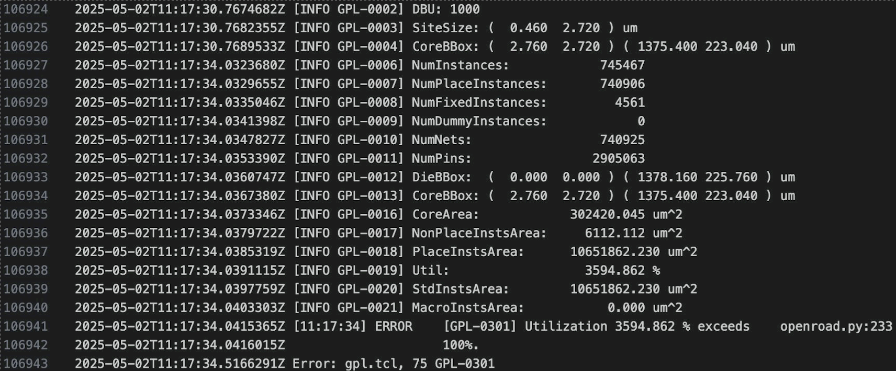

# ASIC Project - Phase III

## Team Name: 
ASIC_SPI_SERV

## Team Members:
- Kavish Ranawella (bue6zr)
- Bhasitha Dharmasena (bp2sq)

## Project Title:
TinyTapeout Design for Serial RISC-V (SERV) with SPI memory access

## Project Description:
Serial RISC-V (SERV) is a bit-serial CPU which claims to be the world's smallest RISC-V CPU. In the current implementation, even though most of the core components are serialized, Register File and Memory accessing is still done parallely via a Wishbone interface. With our FPGA project, we aim to achieve pure serialization by implementing memory access through a Serial Peripheral Interface (SPI). With the ASIC project, we aim to implement this design in TinyTapeout.

## Key Objectives:
- Learn intricate details of the OpenLane2 ASIC design flow used in TinyTapout.
- Evaluate the readiness of the SERV with SPI for a tapeout using TinyTapeout.

## Technology Stack:
Tools: Tiny Tapeout, OpenLane2, Verilator, Cocotb

Languages: Verilog, TCL

## Expected Outcomes:
- Github repository for TinyTapeout10.
- Documentation of our findings during our project.

## Tasks:
- Develop Verilog code for a Wishbone-to-SPI converter.
- Integrate the Wishbone-to-SPI converter with the SERV CPU.
- Add the design files to a TinyTapeout GitHub Repository.
- Debug and fix errors triggered by OpenLane when evaluating the design in the GDS flow.
- Verification using open source verification tool, Verilator
- Resource usage evaluation of the new approach
- Documentation

## File Structure
- [fram_connect](https://github.com/hplp/2025-asic-design-projects-asic_spi_i2c/tree/main/fram_connect): Wishbone-to-SPI convertor integrated to the SERV CPU.
- tt10-spi_serv: TinyTapeout GitHub repository added as a submodule.

## Results

The SPI-SERV design was hardened using the TinyTapeout(TT) repository. The final TT implementation made use of a totl of 3X2 tiles with a 80% placement density. The final utilization was 64.5% with a total wire length of 243537um. The picture illustrats the 3D rendered image of the final design on TT. 

  

TT uses cocotb for testing purposes. The cocotb testing scriots were updated to tet the scripts upon uploading to our TT repository. The image below shows an example of how the cocotb tests the design files for reading data memory('Hi, I'm Servant!') and writing (prints 'Yes' if writes successfully)

  

The image below shows the overview resource utilization in TT.

  

The design was also verified using the open soure verification tool, Verilator. 

  

  