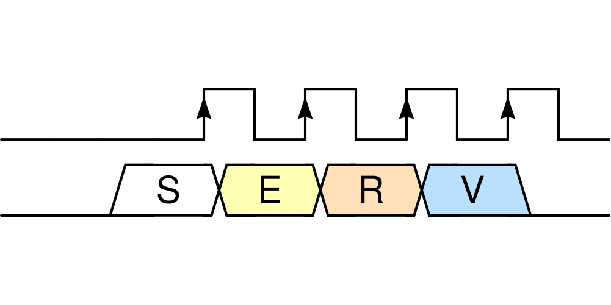
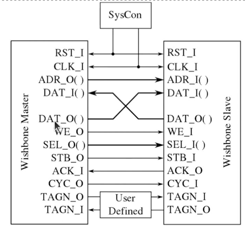
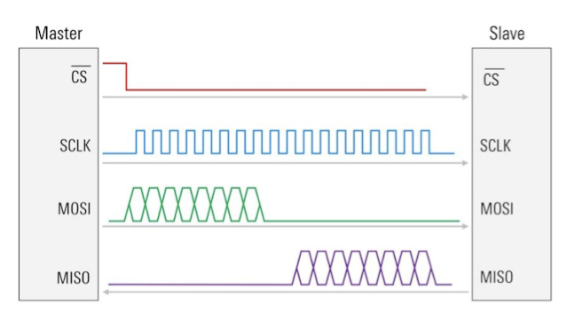
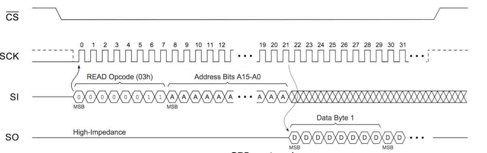
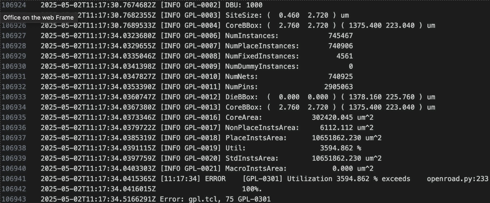
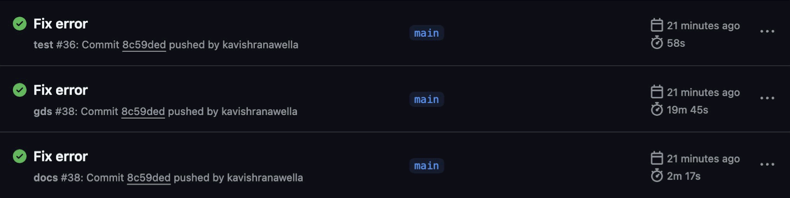
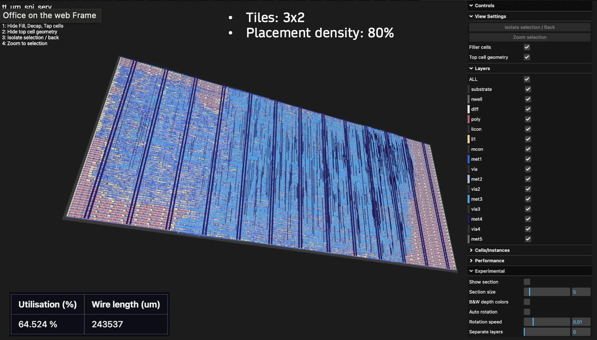
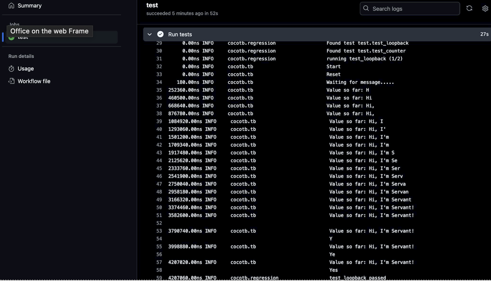
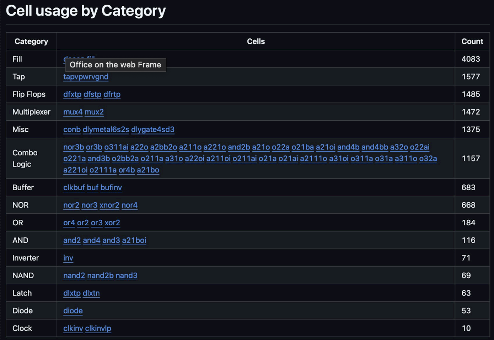
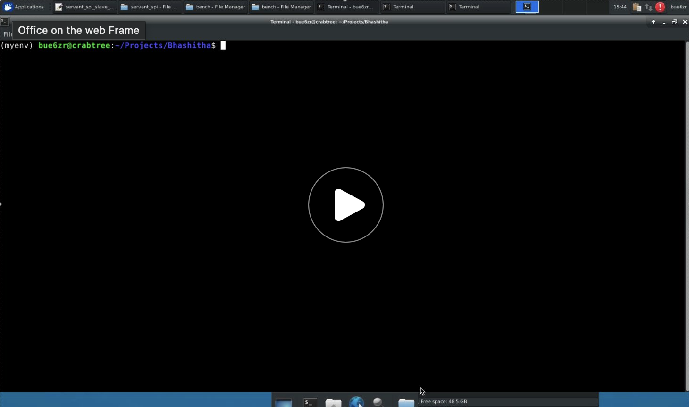

# TinyTapeout Design for Serial RISC-V (SERV) with SPI memory access

## 1. Project Outline

### Team Name: 
ASIC_SPI_SERV

### Final Presentation
[Slides](https://myuva-my.sharepoint.com/:p:/g/personal/bp2sq_virginia_edu/EbR7KFxK4rZKp4n9x-FtiA0BusmC7vetWjMRAcpkG8rAVw?e=tEiBrJ)

### Team Members:
- Kavish Ranawella (bue6zr)
- Bhasitha Dharmasena (bp2sq)

## Project Description:
Serial RISC-V (SERV) is a bit-serial CPU that claims to be the world's smallest RISC-V CPU. In the current implementation, even though most of the core components are serialized, Register File and Memory accessing is still done parallely via a Wishbone interface. With our FPGA project, we aim to achieve pure serialization by implementing memory access through a Serial Peripheral Interface (SPI). With the ASIC project, we aim to implement this design in TinyTapeout.

## Key Objectives:
- Learn intricate details of the OpenLane2 ASIC design flow used in TinyTapout.
- Evaluate the readiness of the SERV with SPI for a tapeout using TinyTapeout.

## Technology Stack:
Tools: Tiny Tapeout, OpenLane2, Verilator, Cocotb

Languages: Verilog, TCL

## Expected Outcomes:
- Github repository for TinyTapeout10.
- Verification methodologies for the ASIC design
- Documentation of our findings during our project.

## Tasks:
- Develop Verilog code for a Wishbone-to-SPI converter.
- Integrate the Wishbone-to-SPI converter with the SERV CPU.
- Add the design files to a TinyTapeout GitHub Repository.
- Debug and fix errors triggered by OpenLane when evaluating the design in the GDS flow.
- Verification using open source verification tool, Verilator
- Resource usage evaluation of the new approach
- Add sanity tests using cocotb
- Documentation

## File Structure
- [fram_connect](https://github.com/hplp/2025-asic-design-projects-asic_spi_serv/tree/main/fram_connect): Wishbone-to-SPI convertor integrated to the SERV CPU.
- [verilator_tb](https://github.com/hplp/2025-asic-design-projects-asic_spi_serv/tree/main/verilator_tb): Verilator testbench for full architecture simulations
- tt10-spi_serv: TinyTapeout GitHub repository added as a submodule.

## 2. Project Overview

### What is SERV?

  

Serial RISC-V (SERV) is bit-serial CPU that claims to be the world's smallest RISC-V CPU. It is,
- Open source (under BSD license)
- Uses Wishbone interface for Data and Instruction Buses
- Compatible with Zephyr OS (light-weight, open-source OS by Linux Foundation)

For this project, we use **Servant** which is a reference platform which packages memory, GPIO and timers with SERV to make it a standalone computer. This also uses Wishbone for the memory interfaces.

### Wishbone vs SPI (Serial Peripheral Interface)

Wishbone:
- A parallel synchronous protocol
- Relatively high speed - **Can access 1 word using 1 clock cycle**
- Requires high wire count **(100+ in total)**

  

> *Figure: Wishbone connection*

SPI:
- A synchronized serial communication protocol
- Can integrate with **4 wires total**
- A Master-Slave Architecture
- Relatively slow - **require 64 clock cycles to access 1 word** 

  

> *Figure: SPI connection*

  

> *Figure: SPI Read (1 word)*

### Why integrate SPI with SERV?

- **Decouples memory from CPU core**: Enables flexible memory placement and simplifies physical design for fabrication
- **Minimal pin count**: Communicates with external RAM using only 4 wires (MISO, MOSI, SCK, CS), reducing I/O complexity
- **Aligns with SERV’s bit-serial philosophy**: Maintains SERV’s ultra-minimal, bit-serial architecture by extending serial design principles to memory access
- **Shrinks logic footprint**: Removes internal RAM, reducing FPGA resource usage and improving area efficiency for ASIC targets

### Original SERV in TinyTapeout
Original SERV cannot fit into the largest size available in the TinyTapeout for an ASIC design. The following is the result we get when we try to fit it to 8x2 Tiles with a target placement density of 80%.

  

Even for the largest size available, it would need 3594.862% utilization to fit this design into TinyTapeout. This is because the design for original SERV contains the Instruction and Data memories. This memory is very large when compared to the actual SERV processor. Moreover, creating memory from the basic logic elements used in TinyTapeout is not very efficient. **Hence, we are removing the memory from the ASIC design with this project and enhancing the design to use an external memory. Since we are using an SPI interface, the IO pins offered by TinyTapeout is enough to connect the memory externally.**

## 3. Results
### TinyTapeout Implementation

  

We use the GitHub workflows available with TinyTapeout to generate the GDSII for the ASIC design of the SPI-SERV. The following are all the GitHub workflow we run,

  

The final TT implementation made use of a total of 3X2 tiles with a 80% target placement density. The final utilization was 64.5% with a total wire length of 243537um. The picture illustrats the 3D rendered image of the GDSII of this design. 

  

### Cocotb Testing
TT uses cocotb for testing in its GitHub workflows. The cocotb testing scripts were updated to add a sanity test for this design. In this sanity test, we run a simple program which covers loads (LW, LH, LB) and stores (SW, SH, SB) to check whether the design still works after each commit we add to the repository. The image below shows the output of this sanity test.

  

> Please note that if 'No' was printed instead of 'Yes', it means that stores are not working.

### TinyTapeout Resource Utilization
The image below shows the overview resource utilization of our ASIC design for the SPI-SERV.

  

### Verification 
#### The Dining Philosophers Problem
The Dining Philosophers Problem is a classic example in computer science that illustrates issues related to synchronization, concurrency, and resource sharing. The main objective of this is to avoid deadlock.

  

* There are five philosophers sitting around a circular table.
* Each philosopher alternates between thinking and eating.
* In front of each philosopher is a plate of spaghetti, and between each pair of philosophers is one fork (so 5 philosophers, 5 forks total).
* To eat, a philosopher needs both the left and right forks.
* A philosopher must pick up the left fork and the right fork, eat, and then put them down.

The ASIC design was fully verified using the open-soure verification tool, Verilator. We cannot use any detailed simulators like ModelSim or Synopsys DVE since it would take couple of minutes just to print one word using SERV. Hence, we are doing this with Verilator, since it is light-weight and fast-enough to show the real-time execution of programs on SERV. 

In this video, we are demonstrating a program tackling this Dining Philosophers Problem running on Zephyr OS booted onto SERV. In the command that starts this simulation we need to give the baud-rate, program to execute and memory size. At the start, it prints that the Zephyr OS is successfully booted and then gives a description of the program it is going to run for the Dining Philosophers Problem. Once the program starts, it prints the status of each Philosopher one-by-one. The statuses include **Eating**, **Thinking**, **Starving**, **Holding one fork** and **Dropped one fork**. When the status of each philosopher change, it is updated on the terminal. Since this is a simulations, we could get very clean prints on the terminal.

  

## 4. Conclusion

In the Project Overview, we have discussed why we need to integrate SPI into SERV. This project has achieved them as follows,

- **Decouples memory from CPU core**: Enables flexible memory placement and simplifies physical design for fabrication-  ***FULLY ACHIEVED***
- **Minimal pin count**: Communicates with external RAM using only 4 wires (MISO, MOSI, SCK, CS), reducing I/O complexity -  ***FULLY ACHIEVED***
- **Aligns with SERV’s bit-serial philosophy**: Maintains SERV’s ultra-minimal, bit-serial architecture by extending serial design principles to memory access -  ***PARTIALLY ACHIEVED***
- **Shrinks logic footprint**: Removes internal RAM, reducing FPGA resource usage and improving area efficiency for ASIC targets -  ***PARTIALLY ACHIEVED***

The first two were fully achieved, since now the memory is placed externally in an FRAM and accessed through SPI which only uses 4 wires. However, the last two were only partially achieved since for this project we are using a Wishbone-to-SPI convertor. The memory accessing is done serially but the Wishbone part still exists in the middle. We have reduced the footprint by moving the memory to an external device, but still we have added logic relevant to the convertor. By replacing Wishbone with SPI in future work, we can fully achieve these two as well. With this project, we have proved the feasibility of doing so.

## 5. Future Work

- **Eliminate Wishbone**: Replace the Wishbone bus with a fully bit-serial interconnect to further reduce logic complexity and align with SERV’s serial architecture.
- **Add bootloader support**: Enable loading programs such as Zephyr RTOS from SPI RAM or other sources at startup.
- **Integrate basic peripherals**:
  * **GPIO**: Provide general-purpose I/O for basic hardware interfacing.
  * **UART (RX)**: Allow serial communication for debugging or basic shell interaction.
- **Implement I2C-based memory access**: Use I2C as an alternative to SPI for connecting external RAM — reducing wire count even further in ultra-minimal systems.

## 6. References

- [Original SERV Github](https://github.com/olofk/serv)
- [Original SERV Documentation](https://serv.readthedocs.io/en/latest/reservoir.html)
